# 人工智能-神经网络原理

神经网络的灵感来自于人体大脑结构，人在思考问题的时候，神经冲动就会在神经突触所连接的无数神经元中传递。据说成人大脑中有1000亿个神经元，比宇宙中星球的数量还多。我们的神经网络就是模拟用很多的节点来处理信息，不过神经网络和大脑还是有区别的，因为大脑的神经冲动传导的过程中不仅仅只有”是”和”非”，还有强弱，缓急之分。

## 神经网络的结构

我们来分析一下神经网络中的一个最简单例子。识别0\~9这几个数字。

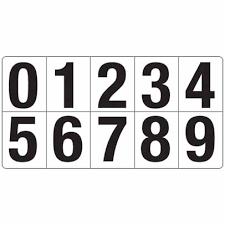

对于人类来说可以很轻易的认出下面的这些数字都是9，但是对于计算机来说，这确实很难。

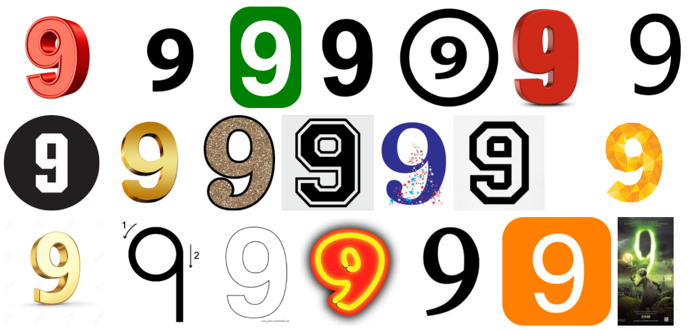

那么我们如何通过神经网络识别出来呢?下面是一个神经网络示意图。

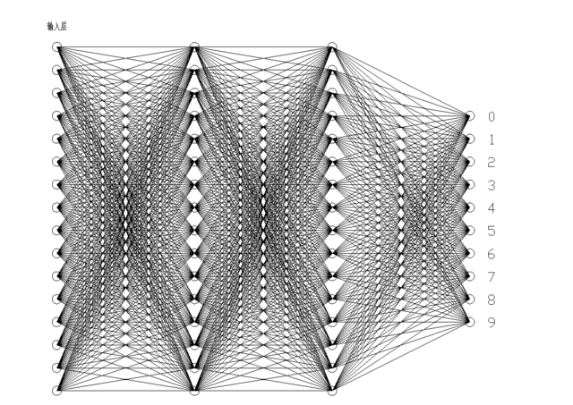

最左边的一列节点是输入，右边的一列节点是输出，把图像的每一个像素点对应到输入层的输入点，输入值为像素点的颜色，假设用0\~1之间的数字表示这些颜色，越接近白色数值越接近0，越接近黑色越接近1。最右边代表输出值，每个节点代表一个结果值，输出点的结果越接近1说明这个点所代表的值概率越大。反之越接近0，概率越小。中间的两层叫做隐藏层，输入层，隐藏层和输出层连接组成神经网络。

我们现在要识别某张图片上的数字9，我们来做一个大胆的假设，如果第一个隐藏层可以识别出上半部分是个圆形，如果第二个隐藏层可以识别出下半部分是竖线，输出层将这个圆和竖线组合起来，就可以识别出这张图片是9。

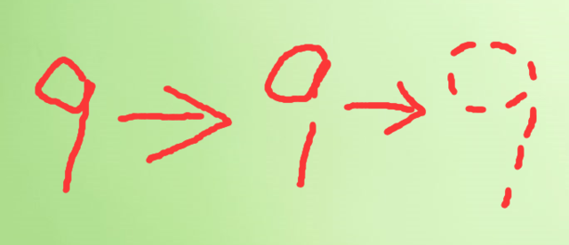

如果这个假设可行的话，那么问题就从如何识别9变成了如何识别圆和竖线，那么你会想，识别圆也很难啊，同样的道理，圆可以切分成很多圆弧，这个问题最终可以演化到如何识别在某个指定区域是否有线段。

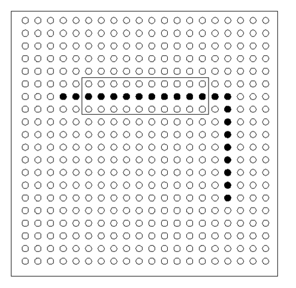

观察方框内的点，如果这个方框里面有直线的话，将这些点的输入值加起来一定是个大于0的数，如果没有线段的话，相加一定是等于或者接近0。

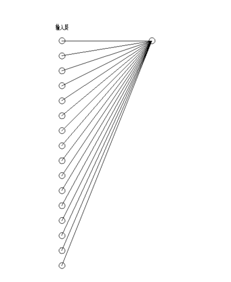

这些累积和构成了第二层也就是第一个隐藏层的值。

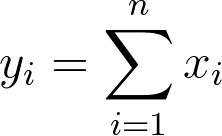

我们现在只关心方框内是否有线段，不关心方框外的点，这时候只需要将关心的点乘以1，不关心的点乘以1以下的数甚至乘以0。

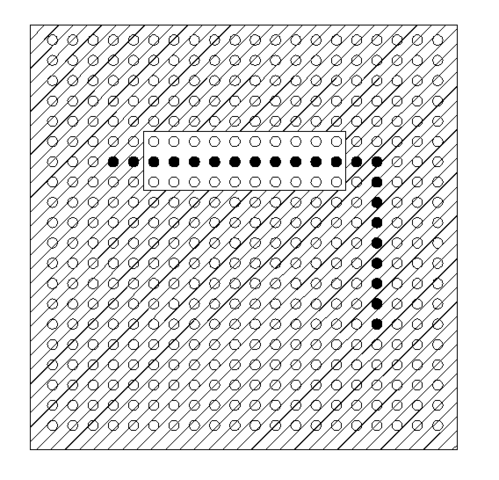

我们把这个要乘的数值叫做权重weight，代表我们对这个输入值得关注程度。

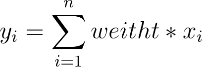

现在我们能做到如何判断一张图片的某个区域是否有线段了，如果第二层的神经节点足够多的话，也就是说可以做无数次这种某个区域是否有线段的假设。这样我们就可以判断出图片上哪些地方有线段了。第一个隐藏层的任务完成。
但是有的时候图片会有噪点，也就是干扰，所以我们需要界定一个标准，只有高于一定的标准才允许激活，所以我们还需要一个偏置值。

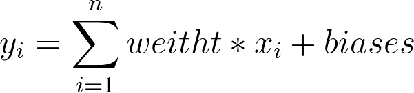

下面来解决另一个问题，输入层的值是0\~1的数，但是第二层是前一层的累加，有可能超过1，甚至可能是很大的数，这样不好，因为1可以代表概率的100%，0可以代表概率的0%，这是很方便的，如果数值的区间不可控，就很难代表概率了，所以我们用一个函数处理一下，可以将y处理成0\~1之间的，y越大越接近1，y越小越接近0，所以就有了如下公式。

如果你熟悉线性代数的话，也许你会觉着用矩阵来表示看起来一目了然。

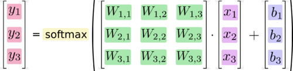

简写为

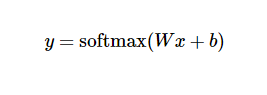

在接下来的网络层里上一层的输出就是下一层的输入，整个神经网络可以理解成一个方程，像素值是输入，图片的结果是几的概率是输出。只不过这个函数非常的复杂，有非常多个输入，10个输出，还有无数个权重和无数个偏置值。

## 神经网络的训练

在训练的最初，会给所有的权重和偏置值赋予随机值，然后将计算值与真实值求误差，计算机会尽可能的减少这个误差。
减小误差的算法叫做梯度下降法，这里我们不做介绍，我们只要知道，计算机能够通过调整那些海量的权重和偏置值能够不断的减小误差。最终达到计算出来的值与真实值得偏差无限小。这时一个识别数字的人工智能就诞生了。
那么对于我们这个2个隐藏层，每层16个神经元的神经网络，它识别模式图片的精确度可以达到多少呢？可以很轻松的达到96%的正确率，最优秀的算法可以达到99%以上，而且增加神经元的个数继续提升。

现在我们回过来看之前的那个假设，如果第一个隐藏层可以识别出上半部分是个圆形，如果第二个隐藏层可以识别出下半部分是竖线，输出层将这个圆和竖线组合起来，就可以识别出这张图片是9。事实是这样么？完全不是。
我们将每个神经元所记录到的图像打印出来。得到的像素点非常混乱。

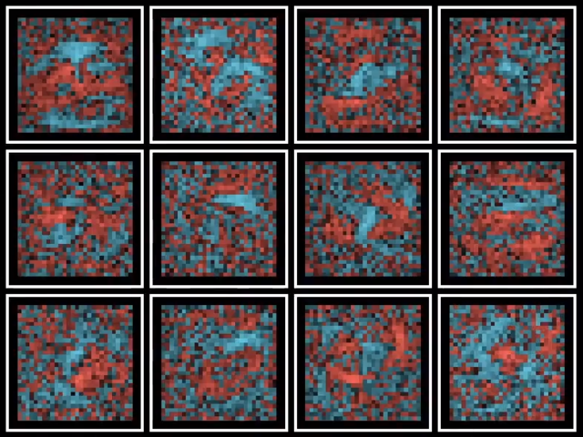

实际上神经网络并没有如我们想像的那样先识别线，再识别圆，最后组成数字9，而是用海量的权重和偏置值生生的将0\~9这10个数字”记住”了。

如果神经网络的节点数真如人类大脑的神经元一样多，如果在算法或者其他技术上有些突破，未来说不定真的会有有情感的人工智能也说不定呢。
