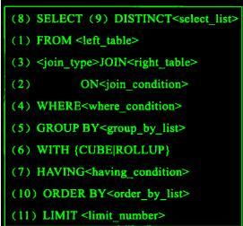

# 常用IO操作

- export one database
```
mysqldump -u dbuser -p dbname > dbname.sql
```

- export one table
```
mysqldump -u dbuser -p dbname tbname > dbname_tb.sql
```

- export one database or table structure
```
mysqldump -u dbuser -p -d --add-drop-table dbname > dbname.db
mysqldump -u dbuser -p -d --add-drop-table dbname tbname > dbname_tb.db
-d no data
--add-drop-table  add drop table before create table
```

- export query
```
mysql -u dbuser -p --default-character-set=gbk -e "select * from tbname" dbname > tbname.db
```

- import data
```
mysql -u dbuser -p --default-character-set=gbk
mysql>show databases;
mysql>use dbname;
mysql>source dbname.sql;
```

- import one database or table
```
mysql -u dbuser -p --default-character-set=gbk dbname < dbname.db
mysql -u dbuser -p --default-character-set=gbk dbname tbname < dbname_tb.db
```

- show database
```
mysql -u dbuser -p --default-character-set=gbk
mysql>show databases;
mysql>create database dbname default character set utf8 collate utf8_general_ci;
mysql>use dbname;
mysql>show tables;
mysql>show columns from tbname;
```

# 重置密码

- view version
```
mysql --version
```

- edit /etc/my.cnf
```
# [mysqld] add content
skip-grant-tables
```

- restart mysql
```
service mysqld restart
```

- edit password for root
```
mysql
mysql>update mysql.user set password = password('toor') where user = 'root';
mysql>flush privileges;
mysql>exit
```

- edit /etc/my.cnf
```
# [mysqld] remove content
skip-grant-tables
```

- restart mysql
```
service mysqld restart
```

- login mysql
```
mysql -uroot -p
```

# 允许远程连接
```
mysql -root -p
mysql>use mysql;
mysql>select host, user from user;
mysql>update user set host = '%' where user = 'root';
mysql>flush privileges;
```

# 删除空用户名的记录

- stop mysql
```
service mysqld stop
```

- skip grant
```
mysqld_safe --skip-grant-table
```

- open a new terminal
```
mysql -u root mysql
mysql>delete from user where user = '';
mysql>flush privileges;
mysql>\q 
```

# 查询语句执行顺序



```
(01) from
(02) on
(03) join
(04) where
(05) group by
(06) avg, sum....
(07) having
(08) select
(09) distinct
(10) order by
(11) limit
```