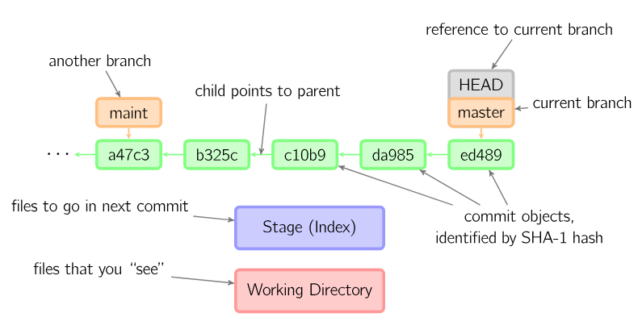
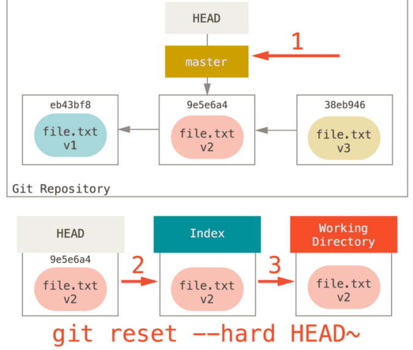

# git reset

简而言之，git reset 命令是用来将当前 branch 重置到另外一个 commit 的，这个动作可能同时影响到 index 以及 work directory。

先举个例子，来一个感性的认识。下面这两条命令让 hotfix 分支向后回退两个提交。

```
git checkout hotfix
git reset HEAD~2
```


hotfix 分支末端的两个提交现在变成了孤儿提交。下次 Git 执行垃圾回收的时候，这两个提交会被删除。如果你的提交还没有共享给别人，可以用git reset撤销这些提交。

## 三棵树

理解 reset （以后还要说 checkout ）的最简方法，就是以 Git 的思维框架（将其作为内容管理器）来管理三棵不同的树。“树” 在我们这里的实际意思是 “文件集合”，而不是指特定的数据结构。

Git 作为一个系统，是以它的一般操作来管理并操纵这三棵树的：

|树|用途|
|---|---|
|HEAD |上一次提交的快照，下一次提交的父结点|
|Index |预期的下一次提交的快照|
|Working Directory |沙盒|

## HEAD

HEAD 是当前分支引用的指针，它总是指向该分支上的最后一次提交。 这表示 HEAD 将是下一次提交的父结点。 通常，可以把 HEAD 看做你的上一次提交的快照。

下面是我从网上搜来的 2 张图片，感谢原作者。



大意就是：HEAD 指向分支（branch），分支指向提交。

## 索引（index）

索引是你预期的下一次提交。这就是当你运行 git commit 时 Git 看起来的样子。Git 将上一次检出到工作目录中的所有文件填充到索引（暂存区），之后你会将其中一些文件替换为新版本，接着通过 git commit 将它们转换为树来用作新提交。

## 工作目录

另外两棵树以一种高效但并不直观的方式，将它们的内容存储在 .git 文件夹中。工作目录会将它们解包为实际的文件以便编辑。 你可以把工作目录当做 “沙盒”，在你将修改提交到暂存区并记录到历史之前，可以随意更改。

## 流程图解

下文会用一幅幅图说明从初始化仓库到操作工作区，再到 add 文件，最后到提交等整个流程。

## 仅工作目录有内容

假设我们进入到一个新目录，其中有一个文件。 我们称其为该文件的 v1 版本，将它标记为蓝色。 现在运行 git init，这会创建一个 Git 仓库，其中的 HEAD 引用指向未创建的分支（master 还不存在）。


## 添加到索引

现在我们想要提交这个文件（file.txt ），所以用 git add 把工作目录中的内容复制到索引中。


## 提交

接着运行 git commit，它会取得索引中的内容并将它保存为一个永久的快照，然后创建一个指向该快照的提交对象，最后更新 master 来指向本次提交。


此时如果我们运行 git status，会发现没有任何改动，因为现在三棵树完全相同。

## 修改文件

现在我们想要对文件进行修改然后提交它。我们将会经历同样的过程；首先在工作目录中修改文件。 我们称其为该文件的 v2 版本，并将它标记为红色。


如果现在运行 git status，我们会看到文件显示在 “Changes not staged for commit” 下面，并被标记为红色，因为该条目在索引与工作目录之间存在不同。 接着我们运行 git add 来将它暂存到索引中。

## 再次添加到索引


此时，由于 Index 和 HEAD 不同，若运行 git status 的话就会看到 “Changes to be committed” 下的该文件变为绿色 ——也就是说，现在预期的下一次提交与上一次提交不同。 最后，我们运行 git commit 来完成提交。

## 再次提交


现在运行 git status 会没有输出，因为三棵树又变得相同了。

切换分支或克隆的过程也类似。 当检出一个分支时，它会修改 HEAD 指向新的分支引用，将索引填充为该次提交的快照，然后将索引的内容复制到工作目录中。

## reset 的作用

在以下情景中观察 reset 命令会更有意义。

为了演示这些例子，假设我们再次修改了 file.txt 文件并第三次提交它。 现在的历史看起来是这样的：


现在，假设我们运行git reset HEAD~（后面可能会跟不同的参数）。

### 第 1 步：移动 HEAD

reset 做的第一件事是移动 HEAD 的指向。 这与改变 HEAD 自身不同（checkout 所做的）；reset 移动 HEAD 指向的分支。 这意味着如果 HEAD 设置为 master 分支（例如，你正在 master 分支上），运行 git reset 9e5e6a4 将会使 master 指向 9e5e6a4。


使用 reset –soft，它将仅仅停在那儿。

结合上图，我们理解一下发生的事情：它本质上是撤销了上一次 git commit 命令。 当你在运行 git commit 时，Git 会创建一个新的提交，并移动 HEAD 所指向的分支来使其指向该提交。 当你将它 reset 回 HEAD~（HEAD 的父结点）时，其实就是把该分支移回原来的位置，而不会改变索引和工作目录。

### 第 2 步：更新索引（–mixed）

接下来，reset 会用 HEAD 指向的当前快照的内容来更新索引。


如果指定 –mixed 选项，reset 将会在这里停止。 这也是默认行为，即如果没有指定任何选项（在本例中是 git reset HEAD~），reset 将会在这里停止。

现在再看一眼上图，理解一下发生的事情：它依然会撤销一上次提交，但还会取消所有暂存。 于是，我们回滚到了所有 git add 和 git commit 的命令执行之前。

### 第 3 步：更新工作目录（–hard）

如果使用 –hard 选项，reset 要做的的第三件事情就是让工作目录看起来像索引。



现在让我们回想一下刚才发生的事情：你撤销了最后的提交（git commit ）、git add 和工作目录中的所有工作。

必须注意，–hard 标记是 reset 命令唯一的危险用法，它也是 Git 会真正地销毁数据的仅有的几个操作之一。其他任何形式的 reset 调用都可以轻松撤消，但是 –hard 选项不能，因为它强制覆盖了工作目录中的文件。

# 总结

reset 命令会以特定的顺序重写这三棵树，在你指定以下选项时停止：

- 移动 HEAD 指向的分支 （若指定了 --soft，则到此停止）；

- 重置 index 以便和 HEAD 相匹配 （若未指定 --hard，则到此停止）；

- 使工作目录看起来像索引
