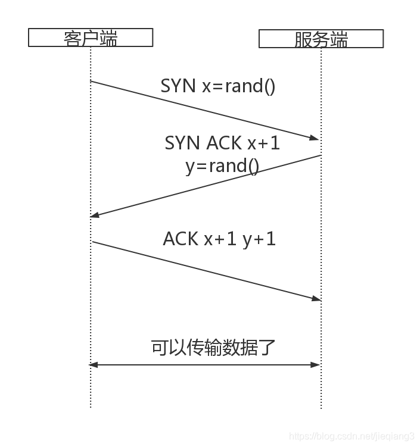
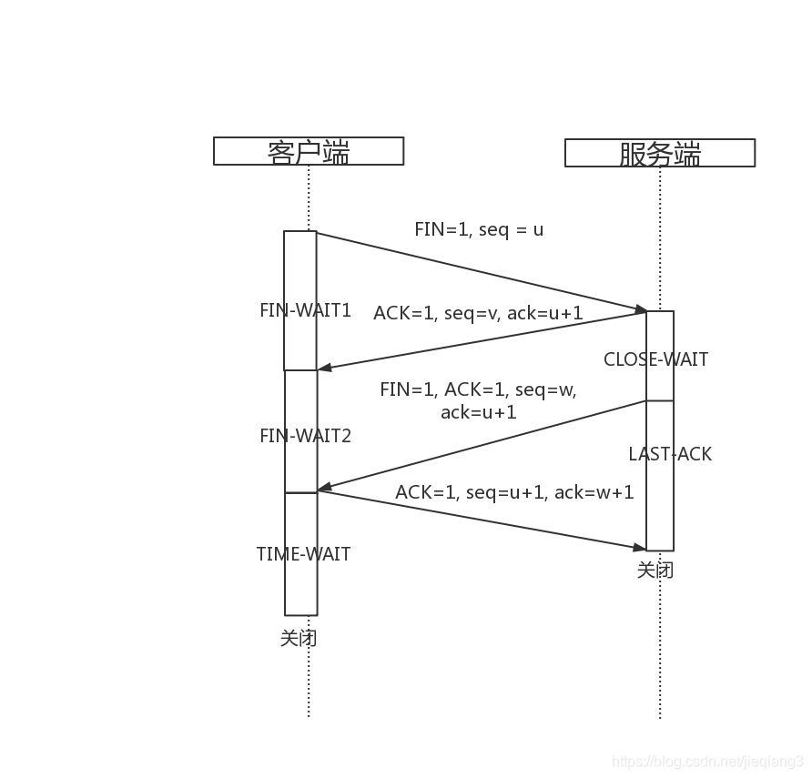
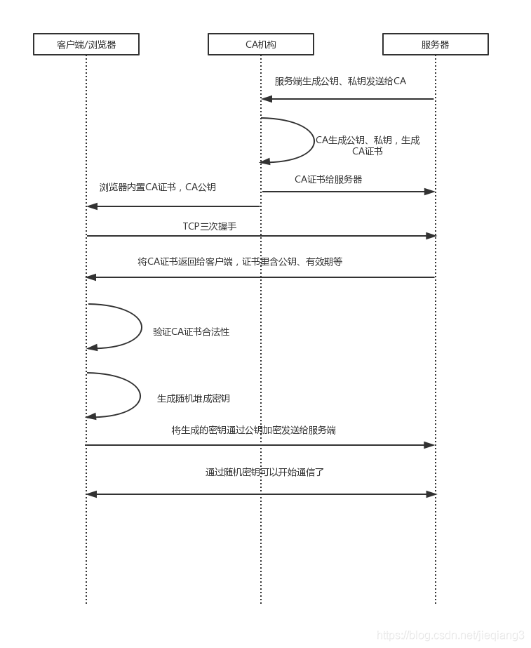
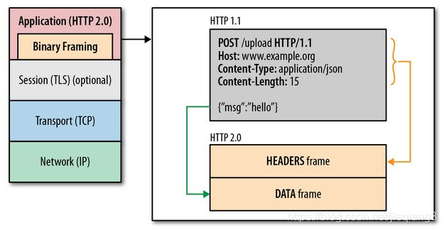

# NET

## TCP

TCP（传输控制协议），负责在不可靠的传输信道之上提供可靠的抽象层。
TCP的存在价值主要专注于可靠两个字，也就是它能够确保发送的所有字节流都能够完整的被接收到，而且到达客户端的顺序也是一样。但凡事都有两面性，如果精确性得到了保证的话，就会牺牲一定的速度和效率。
先来看TCP的连接和断开连接，也就是我们都熟悉的三次握手四次挥手：

### 一、三次握手


1. 首先客户端会生成一个随机序列号x，并发送一个SYN分组，其中可能还包括其他TCP标志和选项。
2. 服务端收到分组以后给x+1，并生成一个随机序列号y，追加自己的标志和选项，然后返回给客户端。
3. 客户端收到服务端消息以后给x和y都+1，然后发送一个ACK分组。

经过这个三次握手以后客户端和服务端就可以互相传输数据了。这里客户端可以在发送ACK分组之后立即发送数据，服务端必须在接收到第三部的ACK分组以后才能传输数据。

那么接下来又有一个问题了，为什么是三次握手呢？为什么不是两次，或者四次五次握手呢？
TCP是一个双向通信协议，为了数据传输的可靠性，通信双方会维护一个序列号，以标识发出去的数据包里有哪些数据是被对方收到的。如果只有两次握手的话，服务端就无法确认他的序列号是否得到了确认，只有客户端的序列号得到了确认。而四次，五次握手的话则会造成资源的浪费。可以肯定的是，三次握手是在确保可靠性的基础上，性能上的最优解。

### 二、四次挥手


重点：TCP关闭连接的时候每个方向都必须要单独进行关闭。当一方发送一个FIN消息的时候，就意味申请终止这一个方向上的数据连接，当收到一个FIN就意味着这一方向上没有数据消息再传过来了，也就不会收到数据了。
TCP客户端服务端双方都可以发起close，这里我们以客户端发起close为图例，来看下过程：

1. 首先客户端发送一个FIN，这就意味着客户端不会再发送任何数据消息到服务端了，然后进入FIN-WAIT1状态。
2. 服务端收到FIN消息以后呢，发送i 个ACK给客户端，确认序号为收到的的序号u+1，然后进入CLOSE_WAIT状态。
3. 服务端发送一个FIN，这就意味着服务端不再发送任何数据消息到客户端，然后进入LAST_ACK状态。
4. 客户端收到FIN消息以后，进入TIME_WAIT状态，然后发送一个ACK给服务端，确认序号为收到的序号w+1，然后进入TIME_WAIT状态。服务端收到ACK报文段以后就关闭连接了。。。客户端等待2MSL以后没有收到任何回复，就说明服务端已经正常关闭，然后自己关闭。

那么为什么要四次挥手呢？？？
TCP的一端发出FIN报文段之后，仅仅表示这一端没有数据要发送给另一端了，但是他仍然能接受来自另一端的数据。所以如上面所示客户端先发送消息给服务端说我不发数据消息给你了，然后服务端发给客户端确认，然后服务端再发消息给客户端跟客户端说我也不发数据消息给你了，然后客户端回复确认，然后服务端关闭，之后客户端等待了以后也关闭。所以这就是需要四次挥手才能来关闭连接的原因。

在实际的网络传输过程中，很容易出现拥塞的现象，TCP对于拥塞控制主要有以下四个算法：

1. 慢启动
2. 拥塞预防
3. 拥塞发生时，快速重传
4. 快速恢复

#### 1. 慢启动
要理解这四个算法的话，首先先要理解拥塞窗口(cwnd)的概念：发送端对从客户端接受确认(ACK)之前可以发送数据的限制。
TCP的拥塞控制主要依赖于这个拥塞窗口来控制，首先三次握手的时候，客户端和服务端会通过ACK分组告知对方自己的接收窗口(rwnd)的大小，然后三次握手ACK消息成功传递以后双方就可以互相发消息了，但是如果在一开始连接刚建立就向网络中发送大量的数据包的话，就很容易导致网络中路由器的缓存空间耗尽，发声拥塞，所以即客户端与服务器之间最大可以传输(未经 ACK 确认的)数据量取 rwnd 和 cwnd 变量中的最小值。而这个cwnd的值会根据算法慢慢指数级增加，同时也设置了一个ssthresh门限值，如果cwnd达到这个值以后会让cwnd增长变得平滑，也就是慢启动。

#### 2. 拥塞预防
拥塞预防的原理就是加入ssthresh门限值来限制 cwnd的增长，当cwnd超过该值以后，慢启动过程结束，进入拥塞避免阶段。拥塞避免的主要思想是加法增大，也就是cwnd的值不再指数级往上升，开始加法增加。此时当窗口中所有的报文段都被确认时，cwnd的大小加1，cwnd的值就随着RTT开始线性增加，这样就可以避免增长过快导致网络拥塞，慢慢的增加调整到网络的最佳值。

#### 3. 快速重传
TCP的每一个报文段都有一个定时器，叫做重传定时器，如果重传定时器超时并且没有得到数据确认的话，TCP就会对该报文段进行重传处理，这里TCP也就把网络定义为拥塞的状态，会进行如下操作：

    3.1. 把ssthresh降低为cwnd值的一半
    3.2. 把cwnd重新设置为1
    3.3. 重新进入慢启动过程

#### 4. 快速恢复
快速恢复是当收到3个重复ACK的时候才会触发，进入快速恢复阶段：

    4.1 当收到3个重复ACK时，把ssthresh设置为cwnd的一半，把cwnd设置为ssthresh的值加3，然后重传丢失的报文段，加3的原因是因为收到3个重复的ACK，表明有3个“老”的数据包离开了网络。
    4.2 再收到重复的ACK时，拥塞窗口增加1。
    4.3 当收到新的数据包的ACK时，把cwnd设置为第一步中的ssthresh的值。原因是因为该ACK确认了新的数据，说明从重复ACK时的数据都已收到，该恢复过程已经结束，可以回到恢复之前的状态了，也即再次进入拥塞避免状态。

## UDP

上面介绍TCP的时候我们已经看出来，TCP是基于连接的协议，建立了可靠的连接以后双方才能互相传递数据。而UDP正好跟TCP相反，UDP是面向非连接的协议，不与对方建立连接，直接把数据包发过去就好了的一种协议，UDP是尽最大努力交付的。
所以UDP的传输速度快，因为不需要什么三次握手这种操作，而且UDP 没有拥塞控制。UDP只适合用于一些只需要传递少量数据，对可靠性要求不是很高的应用场景，比如一些多媒体通信的要求。

## TLS
首先这里我们先来弄清楚一个概念，也就是TLS和SSL的区别，这也是我在看《web性能权威指南》时候一脸懵逼的。
TLS：传输层安全协议，用于两个应用程序之间提供保密性和数据完整性。该协议由两层组成：TLS记录协议和TLS握手协议。
SSL：安全套接字层，位于可靠的面向连接的网络层协议和应用层协议之间的一种协议层。SSL通过互相认证、使用数字签名确保完整性、使用加密确保私密性，以确保客户端和服务端之间的安全通讯。由两层组成：SSL记录协议和SSL握手协议。
两者有什么联系呢？
TLS是以SSL 3.0为基础于1999年作为SSL的新版本推出的，也就是说SSL是TLS的前世，提供更强大的支持。
现在应该弄清楚两者之间的区别以后，我们就可以来看TLS协议的原理了。

### TLS握手

先来看流程图：


1. 首先服务器生成自己的公钥和私钥，将公钥发送给CA机构
2. CA机构生成自己的公钥和私钥，并用私钥对服务器发送给自己的公钥签名生CA证书
3. CA机构把CA证书发送给服务端
4. 浏览器内置了CA根证书的CA公钥
5. 以上都为准备阶段，接下来开始正式连接，客户端向服务端发起三次握手
6. 服务端将CA证书发给客户端，里面包含了服务端生成的公钥，有效期等
7. 客户端根据自己的CA公钥验证CA证书的有效性
8. 客户端生成随机对称密钥
9. 将这个随机对称密钥用服务端给的公钥加密发给服务端
10. 这里如果是银行U盾这种的话，服务器会有一个验证客户端的合法性的步骤，其他基本用不到
11. 然后双方就可以通过这个随机密钥来进行通信了

注意这里的随机对称密钥是对称加密，所以运算速度非常快，而服务器公钥只用于加密"对话密钥"本身，这样就减少了加密运算的消耗时间。另外为了优化性能，为了弥补完整的TLS握手所带来的额外的延迟和计算量，TLS提供了会话恢复功能，即在多个连接间共享这个协商后的安全密钥，也就是上面第9部中生成的用公钥加密的随机对称密钥：
在内部服务器会给每个客户端保存一个会话ID和协商后的会话参数就是密钥，对应客户端也会有保存，这样下次连接的时候就可以告诉对方自己有保存上次连接的资料，这样就可以迅速连接，节省一次往返，相当于加了一层缓冲层。

TLS的握手过程基本确保了传输的信息加密过；有身份认证机制，A想发消息给B，A能确保发送到的是B而不是中间被人拦截接受；有校验机制，能保证信息不会被篡改，这三个机制就是TLS出现的意义所在。

## HTTP 1.x
HTTP 1.1出现的一个重要目标就是为了提升HTTP 1.0的性能。
接下来列举几个比较重要的性能优化点：

1. 持久化连接以支持连接复用；
2. 分块传输编码以支持流失响应；
3. 引入HTTP 管道概念做到可以并行处理；
4. 引入更多的缓存控制策略等。

### 持久化连接
我们知道一个TCP连接创建的时候要经过三次握手才能进行数据传递，而且还可能存在慢启动延迟，所以如果每次去调一个请求如果都需要创建一个TCP连接的话那么显然是很不友好的。所以HTTP 1.1.的时候加入了持久化连接，也就是支持场连接和请求的流水线处理，在一个TCP连接上可以传送多个HTTP请求和响应，HTTP1.1中是默认开启keep-alive的。这个持久化连接不会被一直保留，在空闲一段时间后被关闭，节约资源。

但是如果仅仅通过一个持久化连接，然后不断在这个连接上发送一个又一个的请求的话，经过实践效率并不理想，所以HTTP 1.1又加入了向同一个IP地址重复建立多个TCP连接的机制。大家可以用wireshark抓数据包试试，你会发现在几秒钟里面会建立好几个目的端口为80的TCP连接。现在大多数现代浏览器，包括桌面和移动浏览器，都支持每个主机打开 6 个连接。

### HTTP管道化
HTTP管道化在我的理解其实就是，客户端发送多个http以FIFO队列的形式请求到服务端以后，服务端返回这些请求的响应按照同样的FIFO队列的形式输出到客户端。这里，服务端会严格按照FIFO队列输出，如果服务端并发处理且优先级较高的请求处理时间比较长的话，那么优先级较低且先处理完的请求会被放入服务器的缓冲区，等待优先级较高的请求先回复以后再回复较低的，以FIFO队列形式。
在出现管道化之前，http请求都是顺序请求的，也就是说下一个请求只有在当前请求的响应被完全接受以后才能发送。所以这就有一个问题，http两个请求之间会有很大的延迟。

一般来说，只有幂等的请求才会进行管道化操作，幂等的请求其实就是多次操作都不会改变结果的请求，比如GET和HEAD。所以一般PUT和POST都不会被管道化。

## HTTP 2.0
2012年Google提出了SPDY方案，优化了HTTP 1.X的请求延迟、安全性等问题，而HTTP 2.0可以说是在SPDY的基础上设计出来的升级版plus。
HTTP 2.0最大的特点就是在不该动HTTP 语义，HTTP方法、状态码、URI及首部字段等等核心的东西的基础上，突破了HTTP 1.X的性能限制，最大的改变就是HTTP 2.0新加了一个二进制分帧层。



从上面的图中我们可以看到，二进制分帧层的位置是在应用层和传输层之间，把HTTP 1.1中的首部信息封装到Headers帧中，把request body封装到了DATA 帧中。HTTP 2.0会把所有的传输信息分割为更小的消息和帧，并对他们采用二进制格式的编码形式。
先来看几个在HTTP 2.0中的新概念：

- 流  
已建立的连接上的双向字节流
- 消息  
与逻辑消息对应的完整的一系列数据帧
- 帧  
HTTP 2.0通信的最小单位

HTTP 2.0简而言之，就是在一个TCP连接上，建立任意数量的双向字节流，在每条字节流上以消息的形式来传递消息，而消息的是由一个或者多个帧组成的。
这里这个帧是可以乱序传递的，每个帧都有一个帧首部，帧首部上会有一个流标识符，最后会根据这个流标识符来重新组装顺序。
另外为了进一步增加效率，HTTP 2.0有一个首部压缩的机制，HTTP 2.0在客户端和服务端都会用一个“首部表”来跟踪和存储之前发送的键值对，对于相同的数据，就不会再通过每次请求和响应来发送了。
如果首部发生变化了，那么只需要发送变化了的数据放到Headers帧里，新增或者修改的首部帧就会跟踪到“首部表”，然后不断的更新变化。

## WebSocket
WebSocket 是HTML5中一种全新的web通信技术，是一种最通用最灵活的一个传输机制，真正实现了浏览器与服务器的全双工实时通信。
WebSocket 资源 URL 采用了自定义模式:ws 表示纯文本通信(如 ws://example. com/socket)，wss 表示使用加密信道通信(TCP+TLS)。WebSocket协议可以算是HTTP协议的一种补充，一种增强，以HTTP协议为基础，跟HTTP协议最大的区别在我理解就是：HTTP协议中只有你发送了一个request，你才会得到一个response，是轮询机制的，也就是说response是被动的，不能主动发起。而WebSocket中服务器则随时可以向客户端传递消息，全双工实时通信。

### 协议详解
上面讲区别的时候讲到WebSocket是基于HTTP协议的，其实说的直白点，WebSocket是借用了HTTP的协议来完成了一部分握手，起到向下兼容现有浏览器的作用。
WebSocket协议有两部分组成：握手和数据传输。

### 握手
我们来看一个RFC6455文档中给出的一个客户端握手消息实例：
```
GET /chat HTTP/1.1
Host: server.example.com
Upgrade: websocket
Connection: Upgrade
Sec-WebSocket-Key: x3JJHMbDL1EzLkh9GBhXDw==
Sec-WebSocket-Protocol: chat, superchat
Sec-WebSocket-Version: 13
Origin: http://example.com
```

这里我们可以看到WebSocket使用HTTP来建立连接，但其中又定义了一系列心的header域：Upgrade: websocket
Connection: Upgrade来告诉服务器，我发起的是WebSocket协议，并通过Sec-WebSocket-Key、Sec-WebSocket-Protocol、Sec-WebSocket-Version三个值来校验以及告诉服务器Draft协议版本。
这之后服务器会返回一个标准的HTTP的Response消息来通知客户端我已经接受请求切换为WebSocket协议了：

```
HTTP/1.1 101 Switching Protocols
Upgrade: websocket
Connection: Upgrade
Sec-WebSocket-Accept: HSmrc0sMlYUkAGmm5OPpG2HaGWk=
Sec-WebSocket-Protocol: chat
```

### 数据传输
建立了 WebSocket 连接后，客户端就可以随时发送或接收 UTF-8 或二进制消息。 WebSocket 提供的是一条双向通信的信道，也就是说，在同一个 TCP 连接上，可以双向传输数据，不再需要Request消息。WebSocket 通信只涉及消息，应用代码无需担心缓冲、解析、重建接收到的数据。
另外，WebSocket的数据帧是有序的。

### 心跳机制
websocket为了保持客户端、服务端的实时双向通信，需要确保客户端、服务端之间的TCP通道保持连接没有断开，所以会有一个心跳包机制：

- 发送方 -> 接受方：ping，对应opcode为ox9
- 接收方 -> 发送方：pong，对应opcode为0xA

### 经典的性能优化最佳实践
以下内容摘自《web性能权威指南》，我觉得很有参考价值:  
无论什么网络，也不管所用网络协议是什么版本，所有应用都应该致力于消除或减 少不必要的网络延迟，将需要传输的数据压缩至最少。这两条标准是经典的性能优 化最佳实践，是其他数十条性能准则的出发点。

- 减少DNS查找  
每一次主机名解析都需要一次网络往返，从而增加请求的延迟时间，同时还会阻 塞后续请求。
- 重用TCP连接  
尽可能使用持久连接，以消除 TCP 握手和慢启动延迟
- 减少HTTP重定向  
HTTP 重定向极费时间，特别是不同域名之间的重定向，更加费时;这里面既有 额外的 DNS 查询、TCP 握手，还有其他延迟。最佳的重定向次数为零。
- 使用CDN(内容分发网络)  
把数据放到离用户地理位置更近的地方，可以显著减少每次 TCP 连接的网络延 迟，增大吞吐量。这一条既适用于静态内容，也适用于动态内容
- 去掉不必要的资源  
任何请求都不如没有请求快。
- 在客户端缓存资源  
应该缓存应用资源，从而避免每次请求都发送相同的内容。
- 传输压缩过的内容  
传输前应该压缩应用资源，把要传输的字节减至最少:确保对每种要传输的资源 采用最好的压缩手段。
- 消除不必要的请求开销  
减少请求的 HTTP 首部数据(比如 HTTP cookie)，节省的时间相当于几次往返 的延迟时间。
- 并行处理请求和响应  
请求和响应的排队都会导致延迟，无论是客户端还是服务器端。这一点经常被忽 视，但却会无谓地导致很长延迟。
- 针对协议版本采取优化措施  
HTTP 1.x 支持有限的并行机制，要求打包资源、跨域分散资源，等等。相对而 言，HTTP 2.0 只要建立一个连接就能实现最优性能，同时无需针对 HTTP 1.x 的 那些优化方法。