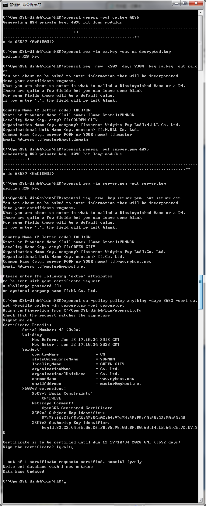
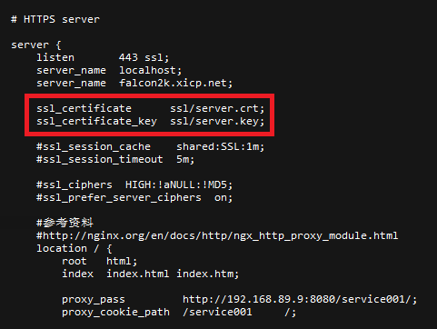

# CA 证书操作

- 生成私钥（1024/2048/4096）
```
openssl genrsa -out ca.key 1024
```

- 制作解密后的私钥（一般无此必要）
```
openssl rsa -in ca.key -out ca_decrypted.key
```

- 生成根证书（公钥）
```
openssl req -new -x509 -days 3650 -key ca.key -out ca.crt
```

- 制作生成网站的证书并用签名认证

如果证书已经存在或者想沿用，则可以直接从这一步开始

- 生成证书私钥
```
openssl genrsa -out server.pem 1024
```

- 制作解密后的证书私钥
```
openssl rsa -in server.pem -out server.key
```

- 生成签名请求
```
openssl req -new -key server.pem -out server.csr
```
在 common name 中填入网站域名，如 www.baidu.com 即可生成该站点的证书，同时也可以使用泛域名如 *.baidu.com 来生成所有二级域名可用的网站证书。

- 用证书进行签名
```
openssl ca -policy policy_anything -days 3650 -cert ca.crt -keyfile ca.key -in server.csr -out server.crt
```

- 制作过程

 

- Nginx配置

以下是 Nginx 启用的部分配置，需要设置 ssl_certificate 和 ssl_certificate_key 指定证书和公钥，并且 listen 443，然后重新启动 Nginx，浏览器就可以用 https://yourhost 的方式访问网页了。


