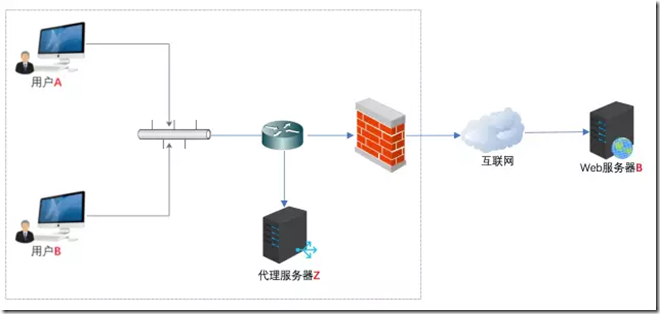
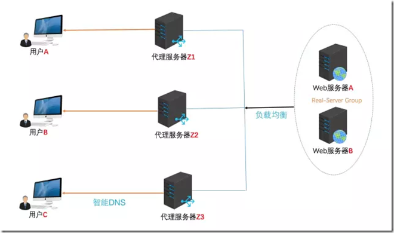

# nginx

## env
```
#编译条件
yum -y install make zlib zlib-devel gcc-c++ libtool  openssl openssl-devel
```

## 下面是虚拟主机的配置（nginx.conf）
```
user www www;
worker_processes 2; #设置值和CPU核心数一致
error_log /usr/local/webserver/nginx/logs/nginx_error.log crit; #日志位置和日志级别
pid /usr/local/webserver/nginx/nginx.pid;
#Specifies the value for maximum file descriptors that can be opened by this process.
worker_rlimit_nofile 65535;
events
    {
        use epoll;
        worker_connections 65535;
    }
http
    {
        include mime.types;
        default_type application/octet-stream;
        log_format main  '$remote_addr - $remote_user [$time_local] "$request" '
        '$status $body_bytes_sent "$http_referer" '
        '"$http_user_agent" $http_x_forwarded_for';

        #charset utf8;

        server_names_hash_bucket_size 128;
        client_header_buffer_size 32k;
        large_client_header_buffers 4 32k;
        client_max_body_size 8m;

        sendfile on;
        tcp_nopush on;
        keepalive_timeout 60;
        tcp_nodelay on;
        fastcgi_connect_timeout 300;
        fastcgi_send_timeout 300;
        fastcgi_read_timeout 300;
        fastcgi_buffer_size 64k;
        fastcgi_buffers 4 64k;
        fastcgi_busy_buffers_size 128k;
        fastcgi_temp_file_write_size 128k;
        gzip on;
        gzip_min_length 1k;
        gzip_buffers 4 16k;
        gzip_http_version 1.0;
        gzip_comp_level 2;
        gzip_types text/plain application/x-javascript text/css application/xml;
        gzip_vary on;

        #limit_zone crawler $binary_remote_addr 10m;
        #下面是server虚拟主机的配置
        server
            {
                listen 80; #监听端口
                server_name localhost; #域名
                index index.html index.htm index.php;
                root /usr/local/webserver/nginx/html; #站点目录
                location ~ .*\.(php|php5)?$
                    {
                        #fastcgi_pass unix:/tmp/php-cgi.sock;
                        fastcgi_pass 127.0.0.1: 9000;
                        fastcgi_index index.php;
                        include fastcgi.conf;
                    }
                location ~ .*\.(gif|jpg|jpeg|png|bmp|swf|ico)$
                    {
                        expires 30d;
                        #access_log off;
                    }
                location ~ .*\.(js|css)?$
                    {
                        expires 15d;
                        #access_log off;
                    }
                access_log off;
            }
    }
```

## 三种代理

### 一、正向代理(Forward Proxy)

一般情况下，如果没有特别说明，代理技术默认说的是正向代理技术。
正向代理（forward）是一个位于客户端 【用户A】和原始服务器(origin server)【服务器B】之间的服务器【代理服务器Z】，为了从原始服务器取得内容，用户A向代理服务器Z发送一个请求并指定目标(服务器B)，然后代理服务器Z向服务器B转交请求并将获得的内容返回给客户端。客户端必须要进行一些特别的设置才能使用正向代理，如下图所示：


从上图看，所谓的正向代理就是代理服务器【Z】替代访问方【用户A】去访问目标服务器【服务器B】。
下面就是正向代理的意义以及场景

- 1、用户访问本来无法访问的服务器B的资源


假设最初用户A要访问服务器B需要经过R1和R2路由器这样一个路由节点，如果路由器R1或者路由器R2发生故障，那么就无法访问服务器B了。但是如果用户A让代理服务器Z去代替自己访问服务器B，由于代理服务器Z没有在路由器R1或R2节点中，而是通过其它的路由节点访问服务器B，那么用户A就可以得到服务器B的数据了。
现实中的例子就是“翻墙”。不过自从VPN技术被广泛应用外，“翻墙”不但使用了传统的正向代理技术，有的还使用了VPN技术。例如IP-SECT动态vpn技术等

- 2、加速访问服务器B资源

这种说法目前不像以前那么流行了，主要是带宽流量的飞速发展。早期的正向代理中，很多人使用正向代理就是提速。
还是如图2假设用户A到服务器B，经过R1路由器和R2路由器，而R1到R2路由器的链路是一个低带宽链路。而用户A到代理服务器Z，从代理服务器Z到服务器B都是高带宽链路。那么很显然就可以加速访问服务器B了。

- 3、Cache作用


Cache（缓存）技术和代理服务技术是紧密联系的（不光是正向代理，反向代理也使用了Cache（缓存）技术。如上图所示，如果在用户A访问服务器B某数据F之前，已经有人通过代理服务器Z访问过服务器B上得数据F，那么代理服务器Z会把数据F保存一段时间，如果有人正好取该数据F，那么代理服务器Z不再访问服务器B，而把缓存的数据F直接发给用户A。这一技术在Cache中术语就叫Cache命中。如果有更多的像用户A的用户来访问代理服务器Z，那么这些用户都可以直接从代理服务器Z中取得数据F，而不用千里迢迢的去服务器B下载数据了。

- 4、客户端访问授权

这方面的内容现今使用的还是比较多的，例如一些公司采用ISA Server做为正向代理服务器来授权用户是否有权限访问互联网，如下图所示：



如上图防火墙作为网关，用来过滤外网对其的访问。假设用户A和用户B都设置了代理服务器，用户A允许访问互联网，而用户B不允许访问互联网（这个在代理服务器Z上做限制）这样用户A因为授权，可以通过代理服务器访问到服务器B，而用户B因为没有被代理服务器Z授权，所以访问服务器B时，数据包会被直接丢弃。

- 5、隐藏访问者的行踪

如下图所示，我们可以看出服务器B并不知道访问自己的实际是用户A，因为代理服务器Z代替用户A去直接与服务器B进行交互。如果代理服务器Z被用户A完全控制（或不完全控制），会惯以“肉鸡”术语称呼。


总结：
正向代理是一个位于客户端和原始服务器(origin server)之间的服务器，为了从原始服务器取得内容，客户端向代理发送一个请求并指定目标(原始服务器)，然后代理向原始服务器转交请求并将获得的内容返回给客户端。客户端必须设置正向代理服务器，当然前提是要知道正向代理服务器的IP地址，还有代理程序的端口。

- Nginx正向代理配置示例如下：
```
server{
        resolver 8.8.8.8;
        resolver_timeout 30s; 
        listen 82;
        location / {
                proxy_pass http://$http_host$request_uri;
                proxy_set_header Host $http_host;
                proxy_buffers 256 4k;
                proxy_max_temp_file_size 0;
                proxy_connect_timeout 30;
                proxy_cache_valid 200 302 10m;
                proxy_cache_valid 301 1h;
                proxy_cache_valid any 1m;
        }
}
1、不能有hostname。 
2、必须有resolver, 即dns，即上面的8.8.8.8，超时时间（30秒）可选。 
3、配置正向代理参数，均是由 Nginx 变量组成。
proxy_pass $scheme://$host$request_uri;  
proxy_set_header Host $http_host;  
4、配置缓存大小，关闭磁盘缓存读写减少I/O，以及代理连接超时时间。
proxy_buffers 256 4k;  
proxy_max_temp_file_size 0;  
proxy_connect_timeout 30;  
5、配置代理服务器 Http 状态缓存时间。
proxy_cache_valid 200 302 10m;  
proxy_cache_valid 301 1h;  
proxy_cache_valid any 1m; 
配置好后，重启nginx，以浏览器为例，要使用这个代理服务器，则只需将浏览器代理设置为http://+服务器ip地址+:+82（82是刚刚设置的端口号）即可使用了。
```

### 二、反向代理（reverse proxy）

反向代理正好与正向代理相反，对于客户端而言代理服务器就像是原始服务器，并且客户端不需要进行任何特别的设置。客户端向反向代理的命名空间(name-space)中的内容发送普通请求，接着反向代理将判断向何处(原始服务器)转交请求，并将获得的内容返回给客户端。

使用反向代理服务器的作用如下：

- 1、保护和隐藏原始资源服务器


用户A始终认为它访问的是原始服务器B而不是代理服务器Z，但实用际上反向代理服务器接受用户A的应答，从原始资源服务器B中取得用户A的需求资源，然后发送给用户A。由于防火墙的作用，只允许代理服务器Z访问原始资源服务器B。尽管在这个虚拟的环境下，防火墙和反向代理的共同作用保护了原始资源服务器B，但用户A并不知情。

- 2、负载均衡



当反向代理服务器不止一个的时候，我们甚至可以把它们做成集群，当更多的用户访问资源服务器B的时候，让不同的代理服务器Z（x）去应答不同的用户，然后发送不同用户需要的资源。
当然反向代理服务器像正向代理服务器一样拥有Cache的作用，它可以缓存原始资源服务器B的资源，而不是每次都要向原始资源服务器组请求数据，特别是一些静态的数据，比如图片和文件，如果这些反向代理服务器能够做到和用户X来自同一个网络，那么用户X访问反向代理服务器X，就会得到很高质量的速度。这正是CDN技术的核心。如下图所示：


反向代理结论与正向代理正好相反，对于客户端而言它就像是原始服务器，并且客户端不需要进行任何特别的设置。客户端向反向代理的命名空间(name-space)中的内容发送普通请求，接着反向代理将判断向何处(原始服务器)转交请求，并将获得的内容返回给客户端，就像这些内容原本就是它自己的一样。
基本上，网上做正反向代理的程序很多，能做正向代理的软件大部分也可以做反向代理。开源软件中最流行的就是squid，既可以做正向代理，也有很多人用来做反向代理的前端服务器。另外MS ISA也可以用来在Windows平台下做正向代理。反向代理中最主要的实践就是WEB服务，近些年来最火的就是Nginx了。网上有人说Nginx不能做正向代理，其实是不对的。Nginx也可以做正向代理，不过用的人比较少了。

- Nginx反向代理示例：
```
http {
#    省略了前面一般的配置，直接从负载均衡这里开始
#    设置地址池，后端3台服务器
    upstream http_server_pool {
        server 192.168.1.2:8080 weight=2 max_fails=2 fail_timeout=30s;
        server 192.168.1.3:8080 weight=3 max_fails=2 fail_timeout=30s;
        server 192.168.1.4:8080 weight=4 max_fails=2 fail_timeout=30s;
    }
#    一个虚拟主机，用来反向代理http_server_pool这组服务器
    server {
        listen       80;
#        外网访问的域名        
        server_name  www.test.com; 
        location / {
#           后端服务器返回500 503 404错误，自动请求转发到upstream池中另一台服务器
            proxy_next_upstream error timeout invalid_header http_500 http_503 http_404;
            proxy_pass http://http_server_pool;
            proxy_set_header Host www.test.com;
            proxy_set_header X-Real-IP $remote_addr;
            proxy_set_header X-Forwarded-For  $proxy_add_x_forwarded_for;
        }
        access_log  logs/www.test.com.access.log  combined;
    }
}
最简单的反向代理演示（在一台服务器上做代理服务器，将http请求转发到另一台IIS服务器上，通过二级域名形式访问。）编辑vim nginx.conf
server {
    listen    80;
    server_name test.zhoumengkang.com;
    location / {
        proxy_pass http://121.199.**.*:80;
    }
}
```

### 三、透明代理

透明代理的意思是客户端根本不需要知道有代理服务器的存在，它改编你的request fields（报文），并会传送真实IP。注意，加密的透明代理则是属于匿名代理，意思是不用设置使用代理了。
透明代理实践的例子就是时下很多公司使用的行为管理软件。如下图所示：


用户A和用户B并不知道行为管理设备充当透明代理行为，当用户A或用户B向服务器A或服务器B提交请求的时候，透明代理设备根据自身策略拦截并修改用户A或B的报文，并作为实际的请求方，向服务器A或B发送请求，当接收信息回传，透明代理再根据自身的设置把允许的报文发回至用户A或B，如上图，如果透明代理设置不允许访问服务器B，那么用户A或者用户B就不会得到服务器B的数据。

- Nginx透明代理配置示例：
```
# cat /etc/nginx/sites-enabled/proxy
       server {
                resolver        8.8.8.8;
                access_log      off;
                listen  [::]:8080;
                location / {
                        proxy_pass      $scheme://$host$request_uri;
                        proxy_set_header Host $http_host;
                        proxy_buffers   256 4k;
                        proxy_max_temp_file_size        0k;
                        }
                }
 
iptables -t nat -A PREROUTING -s 10.8.0.0/24 -p tcp --dport 80 -j DNAT --to 192.168.0.253:8080
RAW Paste Data
# cat /etc/nginx/sites-enabled/proxy
       server {
                resolver        8.8.8.8;
                access_log      off;
                listen  [::]:8080;
                location / {
                        proxy_pass      $scheme://$host$request_uri;
                        proxy_set_header Host $http_host;
                        proxy_buffers   256 4k;
                        proxy_max_temp_file_size        0k;
                        }
                }

iptables -t nat -A PREROUTING -s 10.8.0.0/24 -p tcp --dport 80 -j DNAT --to 192.168.0.253:8080
```


