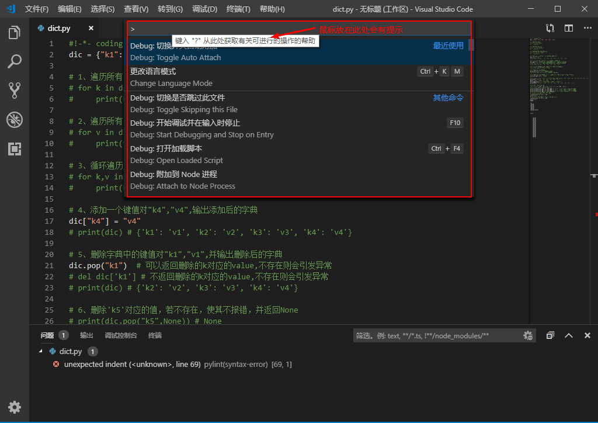
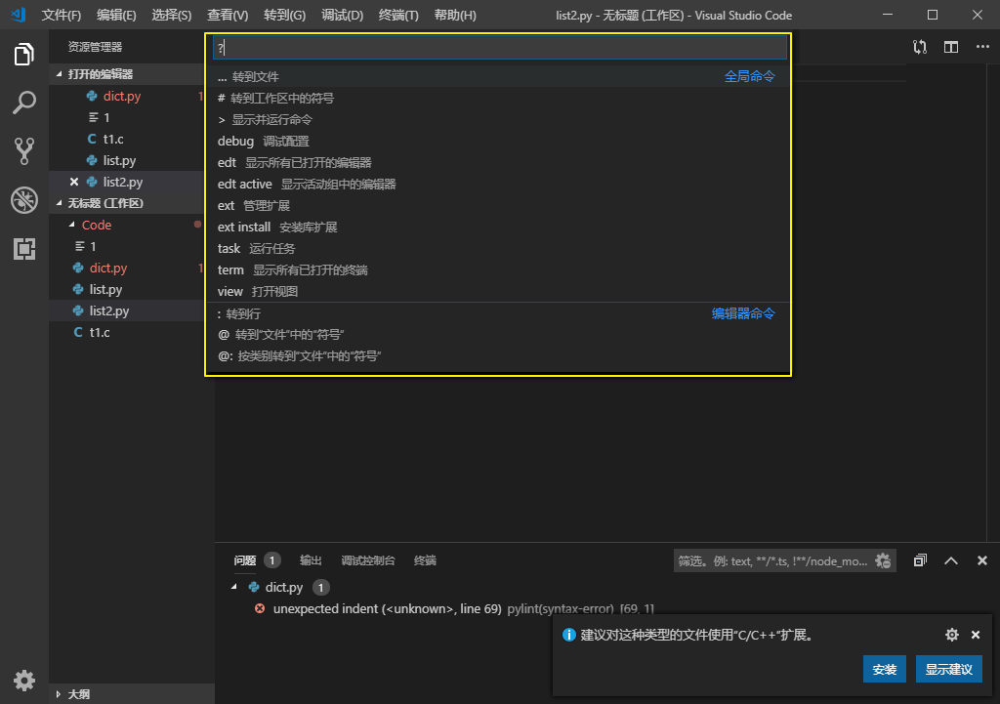
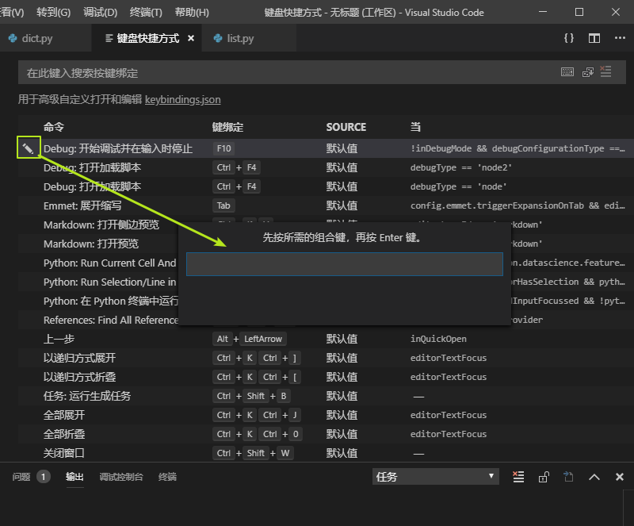
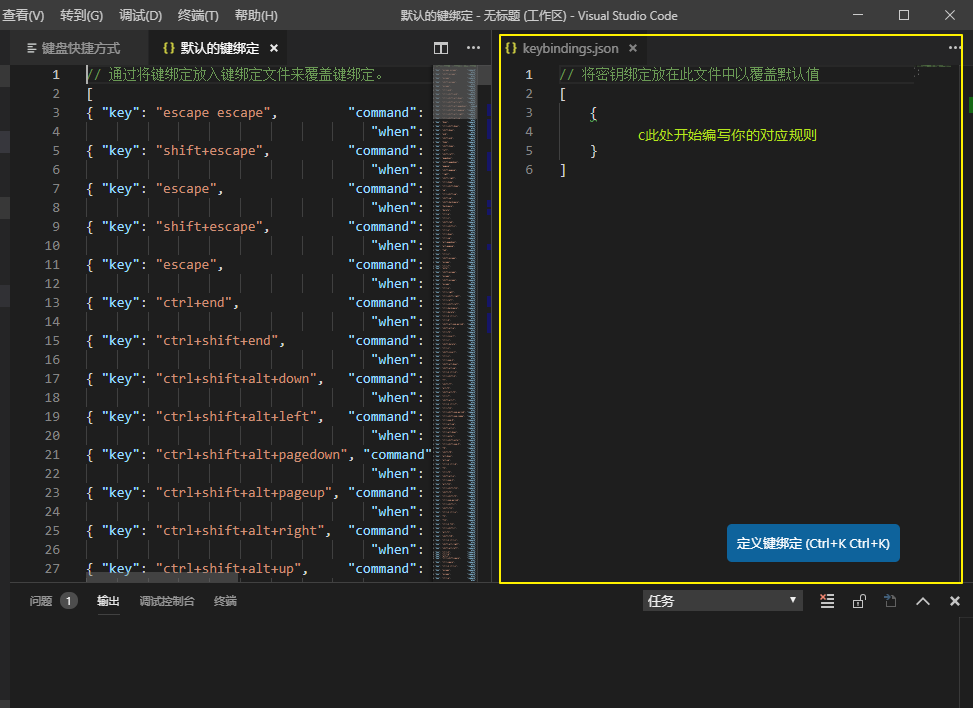

# vs code keymap

## 一、主命令框

F1 或 Ctrl+Shift+P（俗称万能键）  ：打开命令面板。在打开的输入框内，可以输入任何命令,如下图(图片较大，如果查看不清晰，可以在图片上右键 “在新的标签页中打开图片”，查看原图，下同)：



> 按一下 Backspace 会进入到 Ctrl+P 模式

> 在 Ctrl+P 下输入 > 可以进入 Ctrl+Shift+P 模式

> 在 Ctrl+P 窗口下还可以直接输入文件名，跳转到该文件

> 在 Ctrl+P 模式下输入 “?” 会弹出下拉菜单，如下图所示：



> ?   列出当前可执行的动作

> !   显示 Errors或 Warnings，也可以 Ctrl+Shift+M

> :   跳转到行数，也可以 Ctrl+G 直接进入

> @    跳转到 symbol（搜索变量或者函数），也可以 Ctrl+Shift+O 直接进入

> @    根据分类跳转 symbol，查找属性或函数，也可以 Ctrl+Shift+O 后输入" : "进入

> \#   根据名字查找 symbol，也可以 Ctrl+T

## 二、常用快捷键

### 1、编辑器与窗口管理

```
新建文件:   Ctrl+N

文件之间切换:   Ctrl+Tab

打开一个新的VS Code编辑器:    Ctrl+Shift+N

关闭当前窗口:   Ctrl+W

关闭当前的VS Code编辑器:   Ctrl+Shift+W

切出一个新的编辑器窗口（最多3个):   Ctrl+\

切换左中右3个编辑器窗口的快捷键:   Ctrl+1  Ctrl+2  Ctrl+3
```

### 2、代码编辑

(1) 格式调整
```

代码行向左或向右缩进:   Ctrl+[ 、 Ctrl+]

复制或剪切当前行/当前选中内容:   Ctrl+C 、 Ctrl+V

代码格式化:   Shift+Alt+F

向上或向下移动一行:   Alt+Up 或 Alt+Down

向上或向下复制一行:   Shift+Alt+Up 或 Shift+Alt+Down

在当前行下方插入一行:   Ctrl+Enter

在当前行上方插入一行:   Ctrl+Shift+Enter
```

(2) 光标相关
```
移动到行首:   Home

移动到行尾:   End

移动到文件结尾:   Ctrl+End

移动到文件开头:   Ctrl+Home

移动到定义处:   F12

查看定义处缩略图(只看一眼而不跳转过去):    Alt+F12

选择从光标到行尾的内容:   Shift+End

选择从光标到行首的内容： Shift+Home

删除光标右侧的所有内容(当前行):   Ctrl+Delete

扩展/缩小选取范围： Shift+Alt+Right 和 Shift+Alt+Left

多行编辑(列编辑):   Alt+Shift+鼠标左键 或 Ctrl+Alt+Down/Up

同时选中所有匹配编辑(与当前行或选定内容匹配):   Ctrl+Shift+L

下一个匹配的也被选中:   Ctrl+D

回退上一个光标操作:   Ctrl+U

撤销上一步操作: Ctrl+Z

手动保存:   Ctrl+S
```

(3) 重构代码
```
找到所有的引用:   Shift+F12

同时修改本文件中所有匹配的:   Ctrl+F2

跳转到下一个 Error 或 Warning:   当有多个错误时可以按 F8 逐个跳转
```

(4) 查找替换
```
查找:   Ctrl+F

查找替换:   Ctrl+H
```

(5) 显示相关
```

全屏显示(再次按则恢复):   F11

放大或缩小(以编辑器左上角为基准):   Ctrl +/-

侧边栏显示或隐藏： Ctrl+B

显示资源管理器(光标切到侧边栏中才有效):   Ctrl+Shift+E

显示搜索(光标切到侧边栏中才有效):   Ctrl+Shift+F

显示(光标切到侧边栏中才有效):   Git Ctrl+Shift+G

显示 Debug:    Ctrl+Shift+D

显示 Output:    Ctrl+Shift+U
```

(6) 其他设置
```
自动保存：File -> AutoSave(中文界面下“文件”->“自动保存”) 或者 Ctrl+Shift+P，输入 auto
```

## 三、修改默认快捷键

打开默认键盘快捷方式设置：File -> Preferences -> Keyboard Shortcuts( 中文界面时：“文件”->"首选项"->"键盘快捷方式")，或者：Alt+F -> p -> k -> Enter，进入后如下图一所示。

修改快捷键绑定方法一：直接在对应命令那一行点击，出现笔状图标，点击进入修改，如下图一所示：



修改快捷键绑定方法二：点击搜索栏下侧的“ keybindings.json ”，进入编辑界面，如下图所示：




编写对应规则有一定的方法，如下所示：
```
// 将键绑定放入此文件中以覆盖默认值
[{
    "key": "f8",
    "command": "workbench.action.tasks.runTask",
    "args": "build",
    "when": "editorTextFocus"
}
]

key    表示绑定的键

command    表示执行的命令

args    命令的参数，这里我们是build编译任务

when    快捷键在何时生效，这里指的是编辑区

保存完，你尝试按下F8，任务便顺利运行了。
```

自己的" keybindings.json "文件参考如下(谨慎使用)：
```
// Place your key bindings in this file to overwrite the defaults
[
    // ctrl+space 被切换输入法快捷键占用
    {
        "key": "ctrl+alt+space",
        "command": "editor.action.triggerSuggest",
        "when": "editorTextFocus"
    },
    // ctrl+d 删除一行
    {
        "key": "ctrl+d",
        "command": "editor.action.deleteLines",
        "when": "editorTextFocus"
    },
    // 与删除一行的快捷键互换
    {
        "key": "ctrl+shift+k",
        "command": "editor.action.addSelectionToNextFindMatch",
        "when": "editorFocus"
    },
    // ctrl+shift+/多行注释
    {
        "key":"ctrl+shift+/",
        "command": "editor.action.blockComment",
        "when": "editorTextFocus"
    },
    // 定制与 sublime 相同的大小写转换快捷键
    editor.action.transformToLowercase
    editor.action.transformToUppercase
    {
        "key": "ctrl+k ctrl+u",
        "command": "editor.action.transformToUppercase"
        "when": "editorTextFocus"
    },
    {
        "key": "ctrl+k ctrl+l",
        "command": "editor.action.transformToLowercase"
        "when": "editorTextFocus"
    }
]
```